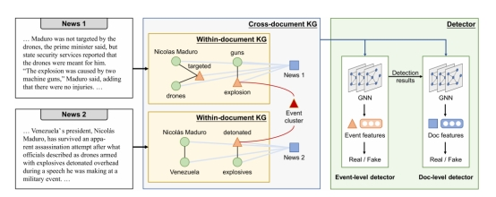

**Cross-document Misinformation Detection based on Event Graph Reasoning**

跨文档错误信息检测

##### Motivation:

跨文档错误信息检测任务：给定一组与局部相关的新闻文档，我们的目标是在文档级别和更细粒度级别的事件级别上检测错误信息。文档级检测旨在检测假新闻文档。事件级检测是一项更细粒度的任务，旨在检测虚假事件，从而确定新闻文档中特定的虚假信息。

##### Previous Work:

detects triplets of false knowledge

##### Methods:

提出了一种基于图的detector，它使用跨文档事件coreference resolution构建一个跨文档知识图，并使用异构图神经网络在两个层次上进行检测。然后，我们将事件级检测结果输入文档级检测器。

关注的是识别错误的事件，而不是关系或实体

给定一组文档，我们首先使用一个信息提取（IE）系统来为每个文档构建一个文档内的KG。然后，我们使用跨文档事件共引用解析将文档内的KG连接起来，形成一个跨文档的KG。最后，我们使用异构图神经网络（GNN）对跨文档的KG进行编码，并在两个层次上进行检测。

 