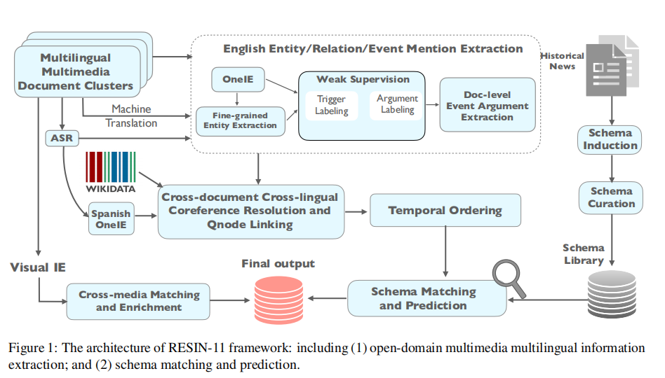

**RESIN-11: Schema-guided Event Prediction for 11 Newsworthy Scenarios**

我们首先对11个已确定的有新闻价值的场景执行模式归纳和管理。具体来说，我们使用GPT-3生成的结果作为大纲，在维基数据本体的帮助下丰富了模式，并扩展了更好地覆盖的步骤。

在IE方面，我们假设我们的输入由关于特定场景（例如，疾病爆发）的多语言多媒体文档集群组成。每个文档集群都包含有关特定复杂事件场景（如COVID-19大流行）的文档。我们的文本IE管道将文档和转录的语音作为输入，并提取实体、关系和事件提及。为了将IE扩展到开放领域，我们采用了弱监督和零射击迁移学习技术。然后，我们执行跨文档、跨语言实体和事件共引用解析，并将它们链接到维基数据。然后通过时间关系提取对提取的事件进行排序。我们的可视化管道从可视化信号（即图像和视频）中提取事件和参数，并使用跨媒体事件共参考分辨率将提取的知识元素链接到我们提取的图中。最后，我们的系统自动从最匹配提取的IE图的模式库中选择模式，并预测新的事件。