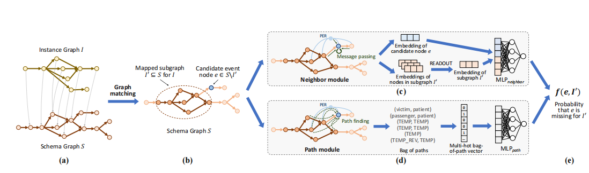
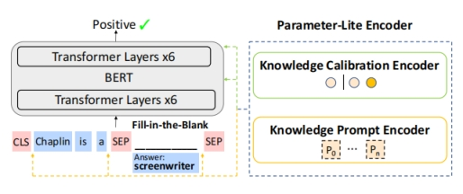

#### **Schema-Guided Event Graph Completion**

模式引导的时间图补全

*event graph completion*:预测事件图中缺失的事件节点

#### Motivation:

现有的link prediction or graph completion方法很难处理事件图，因为它们通常是为单个大图设计的，如社交网络或知识图，而不是多个小的动态事件图.并且只能预测缺失边而非缺失节点。event graph 通常是不完整的和有噪声的。

#### Previos work:

链路预测算法或图补全来细化原始事件图。通常是为单个大图设计的，如社交网络或知识图。只能检测到图中已经存在的两个节点直接缺失的链路，不能判断图中是否缺少一个节点。以及这个新节点怎么连接到现有的节点。

事件图数据集由多个小的事件实例图组成（从相关主题的新闻文章cluster中提取），只包含几十个节点。通常是独立的，但遵循类似的模式。知识图（静态）事件图（动态）

#### Methods：

预测实例图中是否缺少一个来自模式图中的候选事件节点。使用两阶段启发式子图匹配算法映射一个实例图的模式图，建立模式图和实例图之间的联系。子图匹配后，问题等价于推断模式的匹配子图是否缺少候选节点。1）neighbors2）path 结合这两个模块一起预测子图中候选节点缺失的概率。

#### Experiment：

##### Dataset:

(数据集)Car-Bombing,IED-Bombing,Suicide-IED,Pandemic

（三种事件模式）Car-IED General-IED Diease-Outbreak

#### Future Work:

事件图中的连接可能是noisy的

在某些模式中，事件是以分层的方式组织的，一个大事件可能包括多尔小事件。每个事件可能包括多个原子事件。

#### PALT: Parameter-Lite Transfer of Language Models for Knowledge Graph Completion

与修改所有LM参数的微调相比，PALT是轻量级的。PALT没有设计特定于任务的模型结构，而是为我们评估的所有KG完成任务保持相同的模型结构。

 

与微调相比，PALT是一种参数精简的替代方法，可以传递预先训练的语言模型关于知识图完成的知识。我们的方法首先将知识图的完成情况转换到一个填空的任务中。这个公式使预先训练过的语言模型能够产生知识图补全的一般知识。通过参数精简编码器（在虚线框中）引入一些可训练的参数，PALT进一步将语言模型中的一般知识应用于不同的知识图完成任务，而不修改原始语言模型参数（灰色）。

Paramete-lite encoder:首先，它包含了一个由可学习的连续提示标记组成的知识提示编码器，以更好地从预先训练过的lm中回忆出特定于任务的知识。其次，它通过两个知识校准编码器校准预先训练好的lm表示和输出，以完成KG。