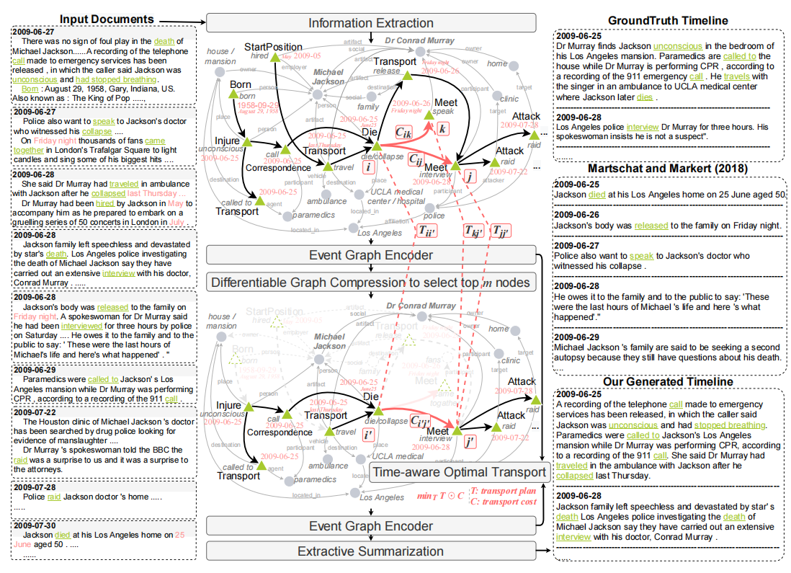

#### Timeline Summarization based on Event Graph Compression via Time-Aware Optimal Transport

将新闻文章表示为一个事件图，因此摘要任务就会将整个图压缩为其显著的子图。通过共享的参数和时间顺序连接起来的事件描述了一个时间线的骨架，包含了在全局事件图中语义相关、结构显著和时间一致的事件。然后引入一种具有时间感知能力的最优传输距离，以无监督的方式学习压缩模型。

Timeline summarization：从多个角度的大量相关新闻中生成一系列具有关键日期的重大新闻事件

##### Difficulty：

1）文档数多 2）时间相互依赖关系3）标记数据有限

##### Previous Methods：

传统无监督方法（文档表示仅限于本地文本特性，而忽略了新闻集合的全局上下文。）预训练神经语言模型（在处理输入文档大小的全局上下文时，在表示容量和记忆效率方面受到限制）

##### Method:

我们的方法旨在找到与输入图距离最小的图，这样当只选择有限数量的节点时，摘要图的信息损失才尽可能的小。最优传输是通过找到两个图之间距离最小的最佳传输计划。要将最优传输应用于时间轴总结，关键是设计距离来评估信息损失，从而我们提出了具有时间感知能力的最佳传输距离。

首先从输入的文档中提取一个事件图G。然后，我们对图进行编码并执行图压缩，将G压缩到其摘要图s。我们的时间感知最优传输用于训练图编码器和压缩模型，其目标是保持语义相关、结构显著和时间一致的事件。

1) **Event graph construction for multi-doc** **encoding**多文档编码的事件图构造。使用最先进的信息提取（IE）系统（Lin et al.，2020），我们从输入文档构建一个单一的事件图。事件通过时间顺序、共享参数和相关参数相连接。图结构使模型能够捕获跨文档的事件之间的全局长距离相互依赖关系。
2) **Unsupervised event graph compression with optimal transport (OT)**具有最优传输（OT）的无监督事件图压缩。提出了一个新的时间轴摘要公式，通过从输入图中选择事件节点来形成一个更小的摘要图。限制了要保留在摘要中的事件节点的总数，使用optimal transport优化摘要图，使其接近于原始图。训练目标是找到具有最小运输距离的input和summary graph之间的最优运输计划。以一种端到端无监督的方式进行模型训练。
3) **Time-aware Gromov-Wasserstein distance**两个图之间的距离应捕获以下标准：1）语义相关性2）**Structural centrality**结构中心性:采用图神经网络，通过编码全局结构拓扑来维护全局上下文嵌入.3)**Temporal coherence**时间连贯性。在时间边缘上定义了具有时间感知的格罗莫夫瓦瑟斯坦距离，并引入了一个时间正则化器来扩大具有较宽时间间隔的事件之间的距离，从而可以捕获时间相干性。它使模型能够选择与新闻集合中的多个事件具有时间依赖性的时间显著事件。此外，时间轴总结对时间顺序很敏感。因此，我们在距离计算中区分了前后的事件。